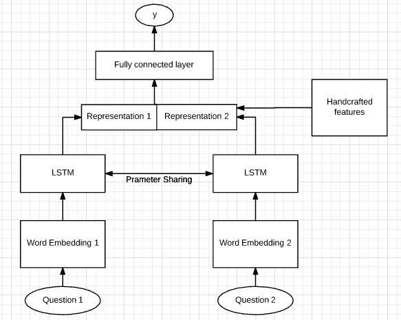
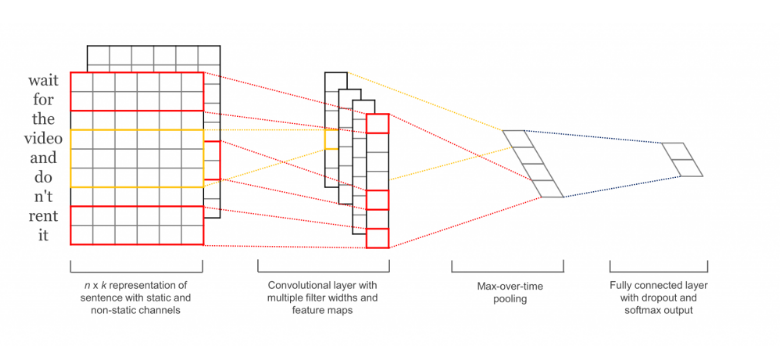

# Kaggle_Quora

## Target
Developed deep learning models in Keras to addresses the Quora Question Pairs. 
https://data.quora.com/First-Quora-Dataset-Release-Question-Pairs 
https://www.kaggle.com/c/quora-question-pairs 

## Model structure - Siamese Network
The first model is based on a Siamese Network Structure for classifying text similarity from <a href="https://www.google.com/url?sa=t&rct=j&q=&esrc=s&source=web&cd=2&ved=0ahUKEwiqkPDo-J3WAhUJ64MKHZyBBvcQFggzMAE&url=https%3A%2F%2Fwww.aaai.org%2Focs%2Findex.php%2FAAAI%2FAAAI16%2Fpaper%2Fdownload%2F12195%2F12023&usg=AFQjCNEDeIU50_crbvc_VrK5qFfZAMS64A">Siamese Recurrent Architectures for Learning Sentence Similarity</a>

The model structure is like:

The top exponetial transformation was replaced with a multiple-layer neural network.
The text sentence was first embedding with the Glove pretrained word embedding. Then I fed each embedded question sentence into the same LSTM layer. Next, the two vector outputs from the LSTM are concatenated into one vector, combined with a vector of handcrafted features were fed into fully connected layers to produce the final classification result.
The visualization of the model structure is:

## Model evaluation
1. Data
The train data is split into (90% train set/10% dev set), the model is trained on the trains set and tuned on the dev set.

2. Framework
Keras(Tensorflow backend) for on paperspace.com with 

3. Pretrained word embedding
The pretrained embedding model is Common Crawl (840B tokens, 300 dimension)
https://nlp.stanford.edu/projects/glove/

4. Best model performance
On Kaggle private leader board 
Loss: 0.17978 
Rank: 660/3307(20%) 
Accuracy on dev set: 88% 

## Model Structure - 1D CNN with global average pooling
Reference: http://www.wildml.com/2015/12/implementing-a-cnn-for-text-classification-in-tensorflow/ 
Model structure looks like:

## Model evaluation 
The embedding and data used are the same as the model above. 
Best model performance(The model was submitted after the competition, so the results is not recorded on leader board)
On Kaggle private leader board 
Loss: 0.17028 
Rank: 552/3307(16%) 
Accuracy on dev set: 89%

## Handcrafted features
Text common ratio(how many words overlap) 
Text bi-gram common ratio(how many two-word phrase overlap) 
jaccard distance 
nlevenshtein distance 
sorensen distance 
sentence word length 
sentence character length 
sentence word length difference 
sentence character length difference 
Tf-IDF(sum, mean) 

## Reference
<a href="https://www.google.com/url?sa=t&rct=j&q=&esrc=s&source=web&cd=5&ved=0ahUKEwickJT52c_UAhVJ2IMKHdRXCuYQFgg6MAQ&url=https%3A%2F%2Fwww.cs.cmu.edu%2F~rsalakhu%2Fpapers%2Foneshot1.pdf&usg=AFQjCNEFB93X4PyZIriYa-iee1lL7250gQ&sig2=AExXqidnx0TpFyO1lb8dPA">Learning Sentence Similarity with Siamese Recurrent Architectures</a> 
https://engineering.quora.com/Semantic-Question-Matching-with-Deep-Learning  
http://www.wildml.com/2015/12/implementing-a-cnn-for-text-classification-in-tensorflow/ 
https://www.kaggle.com/rethfro/1d-cnn-single-model-score-0-14-0-16-or-0-23 
http://www.wildml.com/2015/12/implementing-a-cnn-for-text-classification-in-tensorflow/

